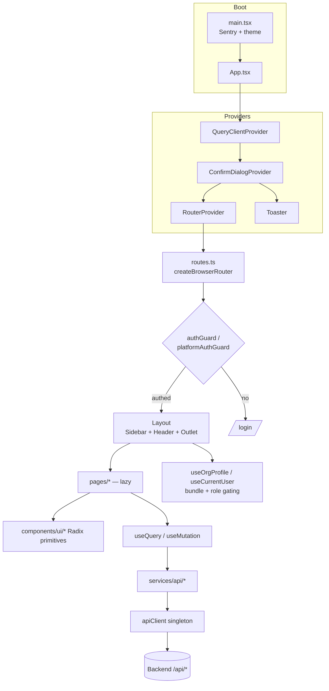
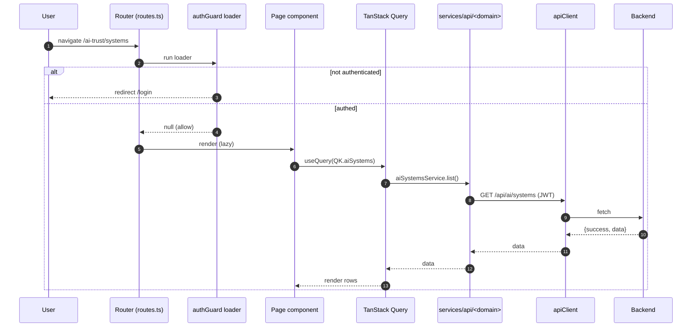
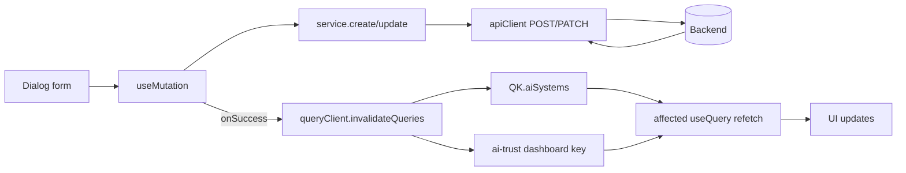

# Manzen — Frontend Architecture

## Boundary Rule

**This repository is a frontend-only React SPA.** It must never contain:

- HTTP server code (Fastify, Express, Hono, etc.)
- Database drivers or ORM clients (`pg`, `prisma`, `knex`, etc.)
- Message queue clients (`bullmq`, `ioredis` for queues, etc.)
- Background workers or scheduled jobs
- Email/SMS delivery services (`resend`, `nodemailer`, etc.)
- Direct infrastructure dependencies (Redis, PostgreSQL, S3, etc.)

All backend logic lives in **isms-backend** (`api.cloudanzen.com`). If you need new server-side functionality, add it there.

## How the Frontend Talks to the Backend

```
Browser → apiClient (src/services/api/client.ts) → VITE_API_URL → isms-backend
```

- `VITE_API_URL` defaults to `https://api.cloudanzen.com` (override in `.env` for local dev)
- Auth: JWT in sessionStorage + HttpOnly cookie fallback
- All API calls go through the singleton `apiClient` — never use raw `fetch()` to the backend

## Directory Structure

```
src/
├── app/                  # React application
│   ├── components/       # Shared UI components (Layout, Sidebar, DataTable, etc.)
│   ├── features/         # Feature-specific components and helpers
│   ├── hooks/            # Custom React hooks
│   ├── pages/            # Route page components (lazy-loaded)
│   ├── routes.ts         # React Router route definitions
│   └── authGuard.ts      # Route-level auth check
├── services/
│   └── api/              # Backend API service layer (one file per domain)
├── shared/               # Frontend-safe shared code (types, contracts, constants)
│   ├── notifications/    # Notification event types and definitions
│   └── riskEngine/       # Risk engine Zod contracts and DTOs
├── lib/                  # Utilities (RBAC, query keys, formatting)
├── hooks/                # App-wide hooks (useCurrentUser, etc.)
├── styles/               # Global styles and theme
└── tests/                # Unit tests (Vitest)
```

## Rules for `src/shared/`

This directory holds **types, constants, and Zod schemas** that are shared between the API service layer and UI components. Rules:

1. No side effects — only types, constants, pure functions, and Zod schemas
2. No imports from `src/app/`, `src/services/`, or `src/hooks/`
3. Must be usable in both browser and test environments
4. If a type originates from the backend API, define the contract here rather than duplicating it across service files

## Prohibited Patterns

| Pattern                                                               | Why                                        | What to do instead                                |
| --------------------------------------------------------------------- | ------------------------------------------ | ------------------------------------------------- |
| `import ... from '@/server/'`                                         | Server code no longer exists here          | Call the backend API via `src/services/api/`      |
| `import ... from '@/workers/'`                                        | Workers no longer exist here               | Backend handles all background jobs               |
| `import ... from '@/domain/'`                                         | Domain layer no longer exists here         | Use `src/shared/` for shared types                |
| Adding `pg`, `bullmq`, `ioredis`, `fastify`, `resend` to package.json | Server-side deps don't belong in frontend  | Add them to isms-backend instead                  |
| `npm run server` or `npm run worker:*`                                | These scripts no longer exist              | Run isms-backend separately                       |
| Raw `fetch()` calls to backend endpoints                              | Bypasses auth injection and error handling | Use `apiClient` from `src/services/api/client.ts` |

## Adding New Features

### New API endpoint needed?

1. Add the endpoint in **isms-backend** (`src/modules/`)
2. Add a service method in `src/services/api/<domain>.ts`
3. Add React Query hook in the relevant page/feature

### New shared type/contract?

1. Add it in `src/shared/<domain>/`
2. Import from `@/shared/...` in both service and UI code

### New page?

1. Create page component in `src/app/pages/`
2. Add lazy route in `src/app/routes.ts`
3. Add API service methods if needed

## Tech Stack

- React 18 + TypeScript (strict)
- Vite 6 (build + dev server)
- React Router 7 (lazy-loaded routes)
- TanStack React Query 5 (server state + caching)
- Tailwind CSS 4 + shadcn/ui (Radix primitives)
- React Hook Form + Zod (form validation)
- Vitest + Testing Library (unit tests)
- Playwright (E2E tests)

---

## Diagrams

> Rendered on GitHub via Mermaid. See
> [docs/REPOSITORY_WALKTHROUGH.md](docs/REPOSITORY_WALKTHROUGH.md) for the
> directory tour and [AI_CONTEXT.md](AI_CONTEXT.md) for conventions.

### Component diagram



### Request flow (a data-driven page)



### Data flow (mutation → cache invalidation)



### Sequence — auth + bundle-gated navigation

```mermaid
sequenceDiagram
  autonumber
  participant U as User
  participant ME as useOrgProfile (/me cache)
  participant NAV as Sidebar
  participant R as Router
  participant BE as Backend

  U->>ME: app load
  ME->>BE: GET /api/auth/me
  BE-->>ME: {user, org:{enabledBundles, companyType}}
  ME-->>NAV: bundles + role
  NAV->>NAV: show AI TrustOps only if AI_GOVERNANCE enabled
  U->>R: click gated route
  R->>R: guard checks token/role
  Note over NAV,BE: UI gating is defense-in-depth;<br/>backend requireBundle is authoritative
```
