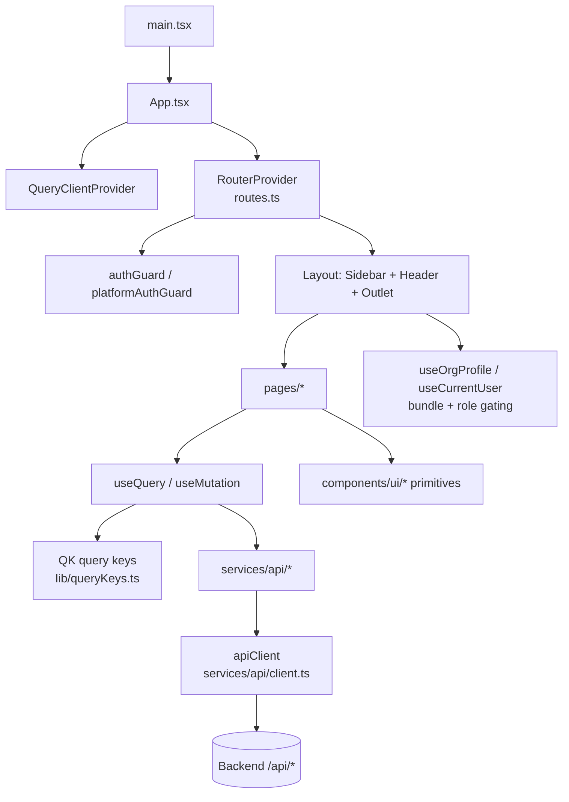
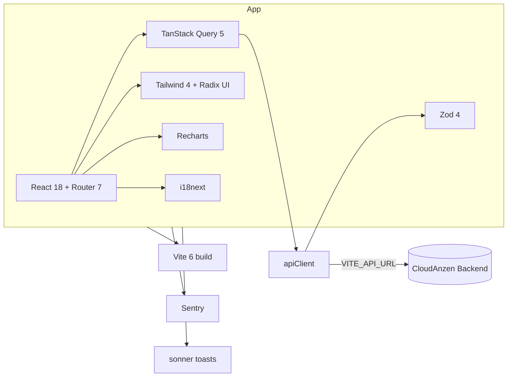

# Repository Walkthrough — CloudAnzen Frontend (Manzen)

A directory-by-directory tour. For the "why" read
[AI_CONTEXT.md](../AI_CONTEXT.md); for diagrams read
[ARCHITECTURE.md](../ARCHITECTURE.md).

---

## 1. Top-level layout

```
Cloudanzen-frontend/
├── src/                    # Application source (see §2)
├── e2e/                    # Playwright end-to-end specs
├── public/                 # Static assets served as-is
├── guidelines/             # Design/engineering guidelines
├── docs/                   # Engineering docs (this file, plans)
├── index.html              # Vite entry HTML (mounts #root)
├── vite.config.ts          # Vite build/dev config + aliases (@/ → src/)
├── playwright.config.ts    # E2E config
├── postcss.config.mjs      # Tailwind/PostCSS
├── tsconfig.json / tsconfig.ci.json  # TS config (ci variant used by typecheck)
├── eslint.config.js + eslint.baseline.config.js  # Lint + no-growth baseline
├── vercel.json / railway.toml  # Deploy config
├── package.json            # deps + scripts (see DEVELOPER_SETUP.md)
├── ARCHITECTURE.md         # Boundary + diagrams
├── AI_CONTEXT.md           # Conventions & patterns (read first)
└── CLAUDE.md               # Repo rules
```

---

## 2. `src/` — application source

```
src/
├── main.tsx           # Bootstraps React root: Sentry, theme, <App/>
├── app/               # The React application (see §3)
├── services/          # API layer + storage helpers (see §4)
├── shared/            # Frontend-safe shared types/contracts (mirrors backend DTOs)
├── lib/               # Utilities: queryClient, queryKeys, rbac, formatting, constants
├── hooks/             # App-wide hooks (useCurrentUser, …)
├── styles/            # Global CSS + Tailwind theme
├── tests/             # Vitest unit tests
├── i18n.ts            # i18next initialization
└── vite-env.d.ts      # Vite env typing
```

---

## 3. `src/app/` — the React app

```
src/app/
├── App.tsx             # Provider stack: QueryClient → ConfirmDialog → Router + Toaster
├── routes.ts           # createBrowserRouter tree (lazy pages under Layout)
├── platform-routes.ts  # Super-admin (platform) route tree
├── authGuard.ts        # requireAuth / requireRoles route loaders
├── platformAuthGuard.ts# Platform-admin guard
├── components/         # Shared components
│   ├── Layout.tsx, Sidebar.tsx, Header.tsx, PageTemplate.tsx, ErrorBoundary.tsx
│   ├── ui/             # Radix/shadcn primitives (button, dialog, select, switch, …)
│   ├── compliance/, filters/, notifications/, pagination/, rbac/, settings/
│   └── AiAssistantChat.tsx, ImpersonationBanner.tsx, CitationViewer.tsx
├── features/           # Feature-scoped components/helpers
├── hooks/              # Component hooks (useOrgProfile, useConfirmDialog, …)
├── pages/              # Route pages, one folder per area (see §5)
└── theme/              # Theming
```

**Layout shell.** Authed routes render inside `Layout` (`Sidebar` + `Header` +
`<Outlet/>`). `PageTemplate` standardizes page title/description/actions.

---

## 4. `src/services/` — API + storage

```
src/services/
├── api/                # 180 files — one typed client per backend domain
│   ├── client.ts       # apiClient singleton (fetch wrapper, JWT, {success,data}, ApiError)
│   ├── auth.ts, users.ts, controls.ts, policies.ts, risks.ts, vendors.ts, …
│   ├── ai*.ts          # AI TrustOps: aiSystems, aiRuntime, aiAgentTrails, aiRag, aiTrust, aiModels
│   ├── riskCenter/, riskEngine*.ts, risk-library.ts  # the risk domain (see AI_CONTEXT §8)
│   └── types.ts        # shared API types (CurrentUser, OrgProfile, bundles, …)
├── authStorage.ts      # JWT get/set/clear (sessionStorage) + cached user
├── impersonationStorage.ts  # support-session marker
└── audit-request-lifecycle.ts
```

Every service file follows the same shape: typed interfaces + `as const` enum
arrays + a `<domain>Service` object of async methods returning `res.data`.

---

## 5. `src/app/pages/` — route pages (by area)

`access` · `account` · `admin` · `ai` (AI TrustOps) · `assets` · `auditor` ·
`auth` · `compliance` · `controls` · `customer-trust` · `integrations` ·
`notifications` · `onboarding` · `personnel` · `platform` · `privacy` ·
`progress` · `risk` · `settings` · `tests` · `trust` · `vendors` · `validations`

Pages are `lazy()`-loaded and mounted in `routes.ts`. The `ai/` folder holds the
AI TrustOps surface (dashboard, systems registry + detail, runtime, agent
trails + trace detail, RAG audit) — the newest and most consistent example of
the page conventions.

---

## 6. `src/shared/`, `src/lib/`, `src/hooks/`

- **`shared/`** — frontend-safe mirrors of backend contracts (e.g.
  `riskEngine/` Zod DTOs, `notifications/` event types). Keep these in sync with
  the backend's shared types; they must not import server code.
- **`lib/`** — `queryClient.ts` (TanStack Query config), `queryKeys.ts` (the
  `QK` factory — the single source of query keys), `rbac/` (client-side
  permission checks), `format-date.ts`, `constants.ts`, `training/`.
- **`hooks/`** — `useCurrentUser`, and app-wide hooks that read `/me`.

---

## 7. Component & data relationships



Reading it: **pages call hooks → hooks call services → services call one
apiClient → backend**. Server state is owned by TanStack Query and keyed via
`QK`. UI is composed from Radix-based `ui/*` primitives.

---

## 8. Dependency graph (external)



Roles: `react` + `react-router` app + routing; `@tanstack/react-query` server
state; `tailwindcss` + `@radix-ui/*` styling/primitives; `recharts` charts;
`i18next`/`react-i18next` i18n; `zod` runtime validation; `vite` bundler;
`@sentry/react` errors; `sonner` toasts; `lucide-react` icons.

---

## 9. Where to start reading (new engineer path)

1. `AI_CONTEXT.md` → `ARCHITECTURE.md`.
2. `src/app/App.tsx` + `src/app/routes.ts` — the shell and route map.
3. `src/services/api/client.ts` — how every call is made.
4. `src/lib/queryKeys.ts` + `queryClient.ts` — server-state conventions.
5. One page end-to-end, e.g. `src/app/pages/ai/AiSystemsPage.tsx` +
   `src/services/api/aiSystems.ts` — page → hook → service → apiClient.
6. `src/app/components/ui/` — the primitive library you'll compose with.
